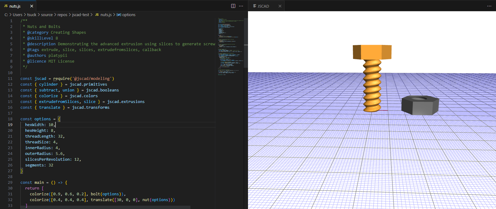

# JSCAD Preview

View rendered JSCAD V2 scripts while editing.

## Features

1. Preview a single .js file (Via explorer context menu or command on active editor)
2. Preview a directory (should be a valid jscad project)
3. Auto refresh on save
4. VSCode for web support

## Requirements

Scripts must be in JSCAD Version 2 syntax

## Known Issues

1. View state is not preserved
2. Cannot preview unsaved files
3. No parameter support
4. Auto refresh does not work on web

## Thanks

Thanks to [crysislinux](https://github.com/crysislinux) & [KillyMXI](https://github.com/KillyMXI) for their contributions to the `vscode-openjscad` extension which was the motivation to develop this version supporting vscode on web.
